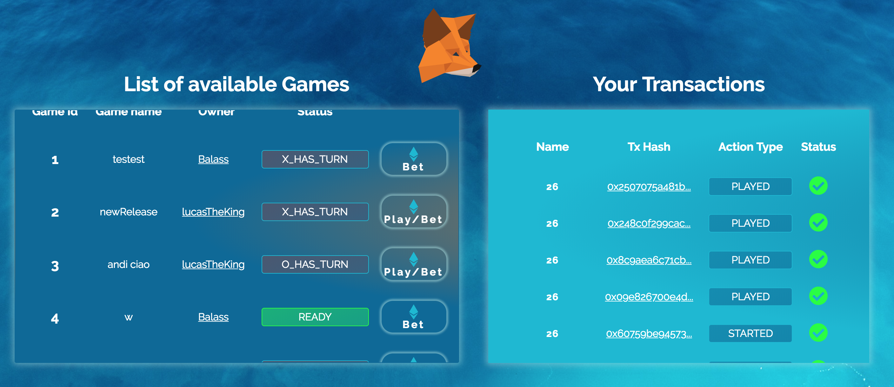
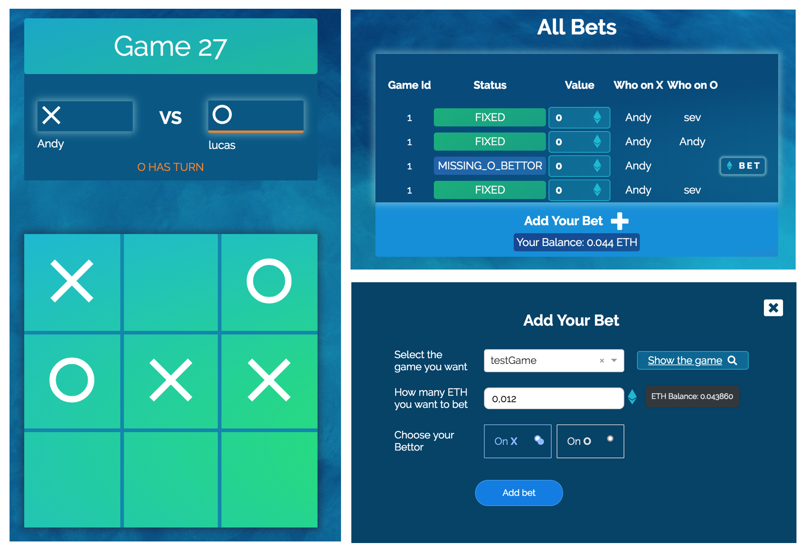

# Decentralized Tic-Tac-Toe
Welcome to our Tic-Tac-Toe game! In the following, you can find some features and data related to our Game. Feel free to contribute and enjoy! 

## Prerequisites
In order to be able to play, our ÐApp requires a [MetaMask extension](https://chrome.google.com/webstore/detail/metamask/nkbihfbeogaeaoehlefnkodbefgpgknn) installed as Chrome plugin. 
Furthermore, the current version of our game has been released and tested for the **Ropsten Testnet**.  In order to get some `Ropsten-ETH` to play, consider to use this [website](http://faucet.ropsten.be:3001/) for receiving `1 Test ETH`. 
>It is not possible to use the *Ethereum Main Network* yet, but we are working for releasing a compatible version soon. 

## Website 
   > The game can be played at the following link: [https://www.tictactoe.bet](http://www.tictactoe.bet)




## How to build
```
$ git clone git@github.com:lucaspelloni2/tic-tac-toe.git
$ cd tic-tac-toe
$ yarn
$ npm start
```
 ## Current Smart Contract: 

Address:  `0x5238F690A682Dcb9e876136A9d5d734c5e560782`
 
  ### Authors
```
Lucas Pelloni
Severin Wullschleger
Andreas Schaufelbühl
```